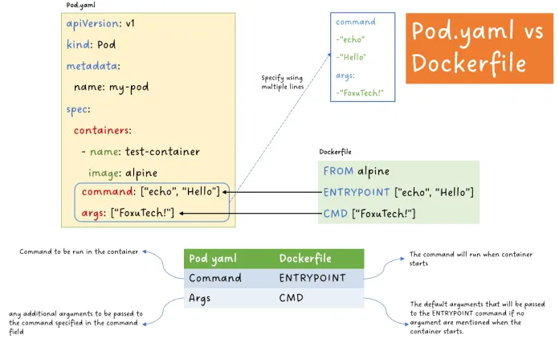

## Kubernetes
#### command and args

\

`command`: Setting the Primary Command
- Think of command as the heart of the action, defining the main command to be run within a container.
- Specify it as an array of strings, with each element representing a part of the command.
```yaml
command: ["echo", "Hello from the container!"]
```
`args`: Providing Additional Arguments
- Need to pass extra information to the command? That’s where args come in.
```yaml
args: ["This message is brought to you by args."]
```